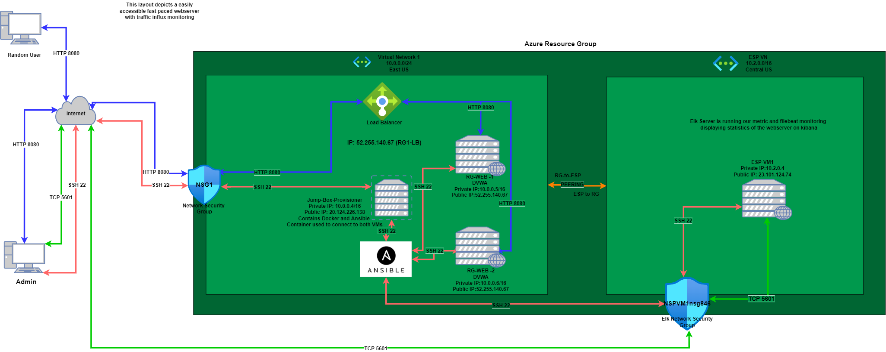
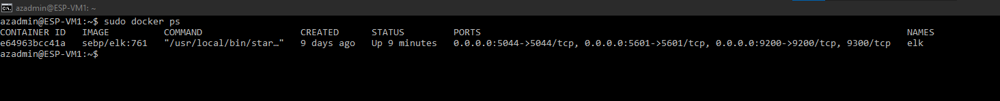

#Azure ELK Stack Setup
A collection of work from my first half of Cybersecurity Certification learning. Including my first Project with Azure.
## Automated ELK Stack Deployment

The files in this repository were used to configure the network depicted below.

These files have been tested and used to generate a live ELK deployment on Azure. They can be used to either recreate the entire deployment pictured above. Alternatively, select portions of the YAML file may be used to install only certain pieces of it, such as Filebeat.

  - _Links to all Playbook Files._

  [Initial Playbook](/Ansible/my-playbook-post.yml)

  [ELK Playbook](/Ansible/install-elk.yml)

  [Filebeat Playbook](Ansible/filebeat-playbook.yml)

  [Metricbeat Playbook](Ansible/metricbeat-playbook.yml)

This document contains the following details:
- Description of the Topology
- Access Policies
- ELK Configuration
  - Beats in Use
  - Machines Being Monitored
- How to Use the Ansible Build

### Description of the Topology

The main purpose of this network is to expose a load-balanced and monitored instance of DVWA, the D*mn Vulnerable Web Application.

Load balancing ensures that the application will be highly accessable, in addition to restricting non-authorized traffic to the network.
- _What aspect of security do load balancers protect? What is the advantage of a jump box?_
  - A load balancers aspect of security is quite broad, they can protect against emerging threats, Authentication for users, and protecting against DDoS attacks. The advantage of a jump box are administrative oversight, management, and updating of all webservers in a Virtual (VM) network.

Integrating an ELK server allows users to easily monitor the vulnerable VMs for changes to the logs and system metrics.
- _What does Filebeat watch for?_
  - _Filebeat can watch log files or locations that we specify. It will collect log events and forward them for indexing._
- _What does Metricbeat record?_
   - _Metricbeat records the metrics and statistics of a system and the services running on a server by outputing the data to a specified location of our choosing._

| Name          | Function  | IP Address | Operating System |
|---------------|-----------|------------|------------------|
| Jump Box      | Gateway   | 10.0.0.4   | Linux            |
| VM-1 (DVWA)   | Webserver | 10.0.0.5   | Linux            |
| VM-2 (DVWA)   | Webserver | 10.0.0.6   | Linux            |
| ESP-VM1 (ELK) | Elk Stack | 10.2.0.4   | Linux            |

### Access Policies

The machines on the internal network are not exposed to the public Internet. 

Only the Jump Box machine can accept connections from the Internet. Access to this machine is only allowed from the following IP addresses:
- _whitelisted IP addresses:_
  - The only whitelisted IP address For your Jump Box machine should be your persnoal IP Address.

Machines within the network can only be accessed by Jump Box.
- _Which machine did you allow to access your ELK VM? What was its IP address?_
  - The machine allowed to access the ELK VM is the Jump box Via ansible container. It connects to the ELK using an established user login name and the ELK Server Private IP address itself via an SSH connection.

A summary of the access policies in place can be found in the table below.

| Name     | Publicly Accessible | Allowed IP Addresses  |
|----------|---------------------|-----------------------|
| Jump Box | No                  | Administrators set IP |
| VM-1     | No                  | 52.255.140.67         |
| VM-2     | No                  | 52.255.140.67         |
| ESP-VM1  | Yes                 | 23.101.124.74         |

### Elk Configuration

Ansible was used to automate configuration of the ELK machine. No configuration was performed manually, which is advantageous because...
- _What is the main advantage of automating configuration with Ansible?_
  - The main advantage of automating configuration with ansible is that it will apply your confirgurations to all ELK machines in your network. While doing this manually requires you to repeat the confirguration task to each machine individually. 

The playbook implements the following tasks:
- The Playbook first installs docker.io, python3-pip, and docker module.
- The Second task is to use a systemctl command to allow/increase the memory used, with a stated amount.
- After which the playbook will proceed to download and launch a docker elk container with established published ports.
- Lastely the playbook will establish a systemd command to allow service(start) of docker on boot/startup.

The following screenshot displays the result of running `docker ps` after successfully configuring the ELK instance.

### Target Machines & Beats
This ELK server is configured to monitor the following machines:
- Machines:
  - Web-1 : 10.0.0.5
  - Web-2 : 10.0.0.6

We have installed the following Beats on these machines:
- _We successfully installed two beats on our machines. We first installed filebeats, after which we proceeded to install metricbeats._

These Beats allow us to collect the following information from each machine:
- Filebeat is used to collect specified system log information and store it in a designated folder. An example would be logs of user logins, or attempted/failed logins. The main design of filebeat was to be a low memory footprint, that is able to process a large amount of data.
-  Metricbeat focuses on collecting metric data on system usage, such as CPU usage, or system uptime based on processes. Metricbeat can also be used to monitor other beats used on a system, or other beats used to monitor the ELK stack.

### Using the Playbook
In order to use the playbook, you will need to have an Ansible control node already configured. Assuming you have such a control node provisioned: 

SSH into the control node and follow the steps below:
- Copy the playbook file to the Ansible container.
- Update the hosts file to include the IP addresses for both webservers and the ELK server followed by the command ansible_python_interpreter=/usr/bin/python3
- Run the playbook, and navigate to kibana web page to check that the installation worked as expected.

+ Which file is the playbook? Where do you copy it?
  - _The Playbook file is install-elk.yml, we copy this into the /etc/ansible directory._
- _Which file do you update to make Ansible run the playbook on a specific machine? How do I specify which machine to install the ELK server on versus which to install Filebeat on?_
  - We have to update the hosts file webservers and ELK sections with the designated IP addresses. After updating our hosts file, when we create a playbook we designate the specific server/machine with the listed hosts designation in the playbook.
- _Which URL do you navigate to in order to check that the ELK server is running?_
  - You will need to proceed to the Kibana website by using the following URL http://[your.VM.IP]:5601/app/kibana. This is accomplished with the public IP address of the established ELK server we created.

_As a **Bonus**, provide the specific commands the user will need to run to download the playbook, update the files, etc._
